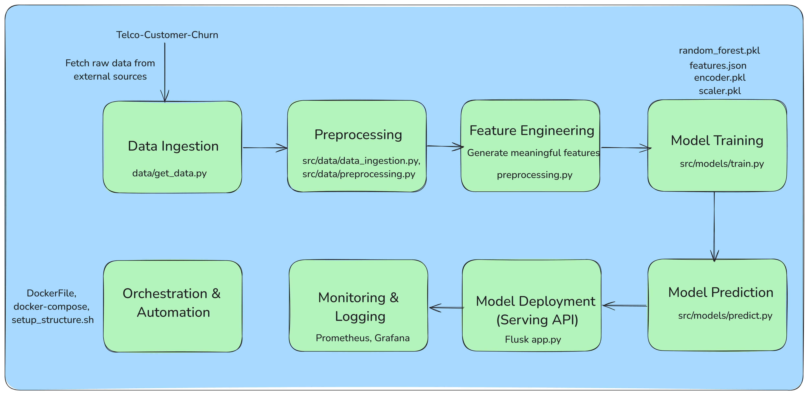
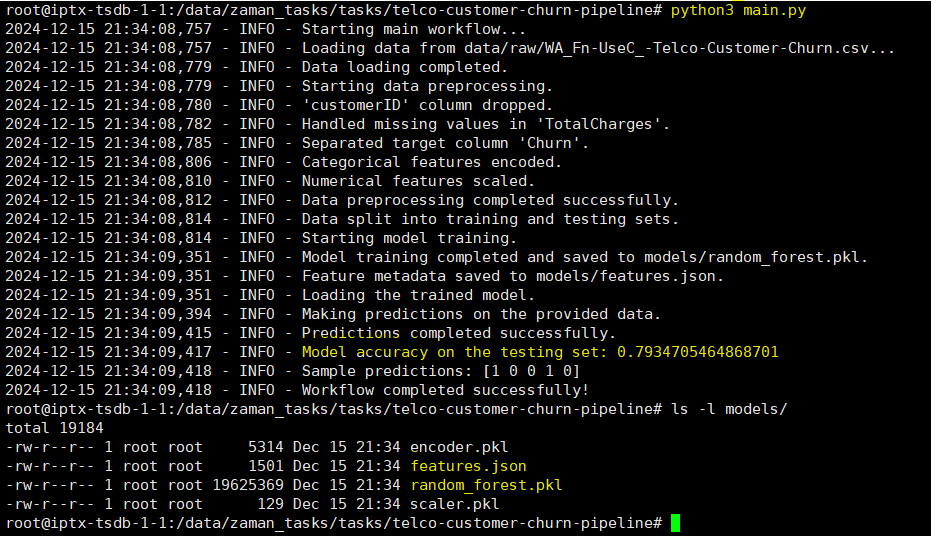
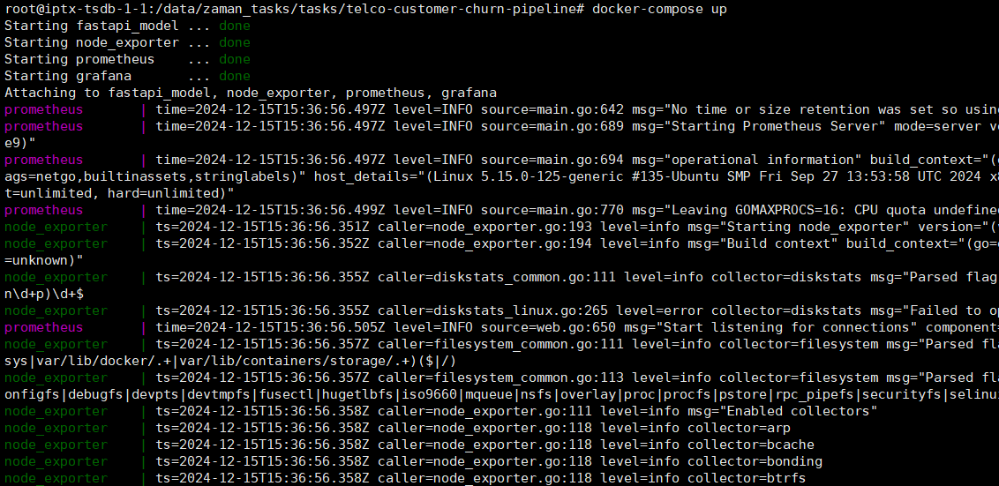
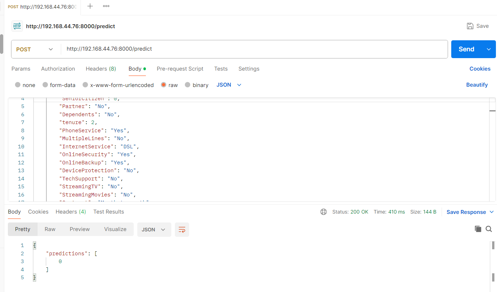
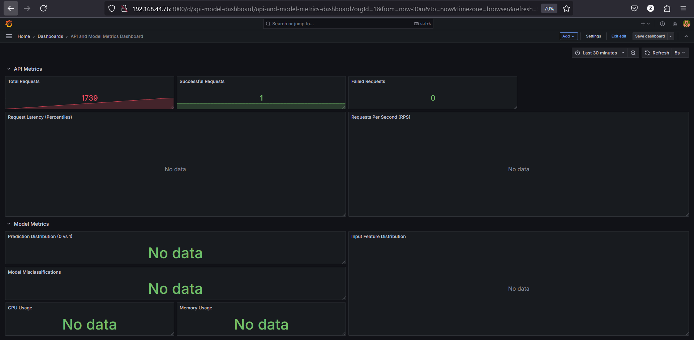

# Building Machine Learning Workflow and Project Setup



## In this project our objectives are:

- Develop a modular training pipeline with Dataset tracking, Experiment tracking along with logging & versioning
- Deploy application with FastAPI and Docker to serve the trained model.
- Implement monitoring for the deployed API using Prometheus and Grafana.

## Project structure

telco-customer-churn-pipeline/<br/>
│<br/>
├── data/<br/>
│ ├── raw/<br/>
│ │ └──get_data.py<br/>
│ ├── processed/<br/>
│ └── final/<br/>
│<br/>
├── logs/<br/>
├── models/<br/>
│ ├── random_forest.pkl<br/>
│ └── features.json<br/>
├── provisioning/<br/>
│ └── datasources<br/>
│ └── prometheus-datasource.yml<br/>
├── src/<br/>
│ ├── data/<br/>
│ │ ├── **init**.py<br/>
│ │ ├── data_ingestion.py<br/>
│ │ └── preprocessing.py<br/>
│ ├── models/<br/>
│ │ ├── **init**.py<br/>
│ │ ├── train.py<br/>
│ │ └── predict.py<br/>
│ ├── utils/<br/>
│ │ ├── **init**.py<br/>
│ │ ├── logger.py<br/>
│ │ └── config.py<br/>
│ └── **init**.py<br/>
├── main.py<br/>
├── requirements.txt<br/>
├── Dockerfile<br/>
├── app.py<br/>
├── docker-compose.yml<br/>
├── prometheus.yml<br/>
└── setup_structure.sh<br/>

## To run the project

### Step 0: Data Loading - Download the dataset (WA*Fn-UseC*-Telco-Customer-Churn.csv) from Kaggle

Data is loaded from data/raw/WA*Fn-UseC*-Telco-Customer-Churn.csv into a Pandas DataFrame.
Adjust the destination_path according to your folder name and then run the script get_data.py located in /data/raw directory. It will download telco-customer-churn data from kagglehub.


### Step 1: Train model

Run main.py located in the root directory of the project. It will

- Load the data from raw directory and
- Preprocess the data: Column Reordering, Missing Values fill, Categorical Encoding, Target Encoding, Numerical Scaling
- Split the data into training and testing sets (20% test data and 80% training data)
- Build a model in .pkl format along with features.json file using training dataset. We have used RandomForestClassifier for the training. The model file will be stored in /models location.
- Make predictions on the test data (20% dataset).
- Calculate acuracy of our model

#### Preprocessing tasks includes:

Column Reordering: Ensures the dataset aligns with expected feature names for the model.
Missing Values: Any missing data is forward-filled to avoid issues during model training.
Categorical Encoding: Converts string-based categorical variables (e.g., gender, Partner, Churn) into numeric representations using LabelEncoder.
Target Encoding: The Churn column is explicitly encoded as binary (0 = No, 1 = Yes).
Numerical Scaling: Continuous variables (tenure, MonthlyCharges, TotalCharges) are standardized using StandardScaler to ensure all features have the same scale.

All logs will be stored in \logs\project.log file.


### Step 2: Deploy application with FastAPI and Docker to serve the trained model

Run docker-compose file located in the root directory using
docker-compose up --build
It will up Grafana, fastapi_model and Prometheus containers. The datasource is located in /provisioning/datasources/prometheus-datasource.yml
node_exporter is used for monitoring the host server performance.


After deploy the app inside a container we have:

- **app endpoint**: server_ip:8000/predict
- **Grafana**: server_ip:3000
- **Prometheus**: http:// server_ip:9090
- **node_exporter**: http:// server_ip:9100
  We will send POST request to app endpoint from Postman app with body:

```json
[
  {
    "gender": "Male",
    "SeniorCitizen": 0,
    "Partner": "No",
    "Dependents": "No",
    "tenure": 2,
    "PhoneService": "Yes",
    "MultipleLines": "No",
    "InternetService": "DSL",
    "OnlineSecurity": "Yes",
    "OnlineBackup": "Yes",
    "DeviceProtection": "No",
    "TechSupport": "No",
    "StreamingTV": "No",
    "StreamingMovies": "No",
    "Contract": "Month-to-month",
    "PaperlessBilling": "Yes",
    "PaymentMethod": "Mailed check",
    "MonthlyCharges": 53.85,
    "TotalCharges": 108.15
  }
]
```



We can see that the model predicted for this particular customer churn will not happen (prediction=0).

In Grafana we need to create dashboard now...

