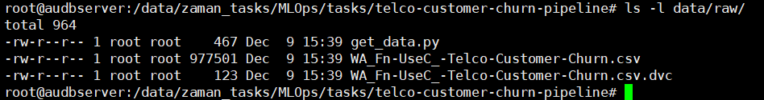
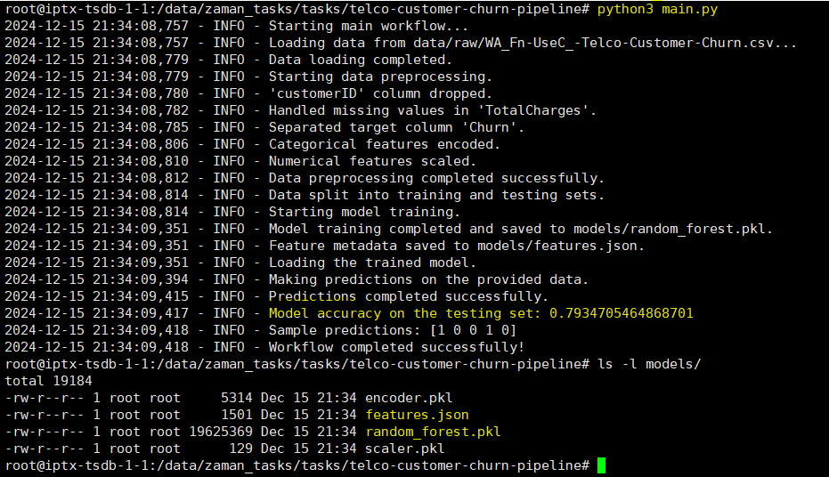
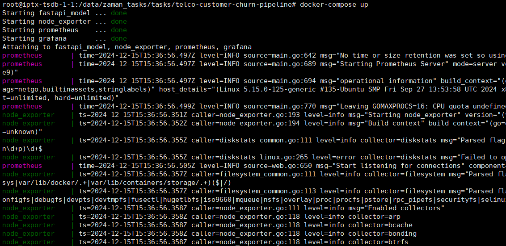

# Building Machine Learning Workflow and Project Setup
## In this project our objectives are:
- Develop a modular training pipeline with Dataset tracking, Experiment tracking along with logging & versioning
- Deploy application with FastAPI and Docker to serve the trained model.
- Implement monitoring for the deployed API using Prometheus and Grafana.

## Project structure
telco-customer-churn-pipeline/
│
├── data/
│   ├── raw/
│   │    └──get_data.py
│   ├── processed/
│   └── final/
│
├── logs/
├── models/
│   ├── random_forest.pkl
│   └── features.json
├── provisioning/
│   └── datasources
│		└── prometheus-datasource.yml
├── src/
│   ├── data/
│   │   ├── __init__.py
│   │   ├── data_ingestion.py
│   │   └── preprocessing.py
│   ├── models/
│   │   ├── __init__.py
│   │   ├── train.py
│   │   └── predict.py
│   ├── utils/
│   │   ├── __init__.py
│   │   ├── logger.py
│   │   └── config.py
│   └── __init__.py
├── main.py
├── requirements.txt
├── Dockerfile
├── app.py
├── docker-compose.yml
├── prometheus.yml
└── setup_structure.sh


## To run the project
### Step 0: Download the dataset (WA_Fn-UseC_-Telco-Customer-Churn.csv) from Kaggle 
Adjust the destination_path according to your folder name and then run the script get_data.py located in /data/raw directory. It will download telco-customer-churn data from kagglehub.


### Step 1: Train model 
Run main.py located in the root directory of the project. It will load the data from raw directory and do preprocessing and then build a model in .pkl format along with features.json file.
All logs will be stored in  \logs\project.log file. 


### Step 2: Deploy application with FastAPI and Docker to serve the trained model
Run docker-compose file located in the root directory using
docker-compose up --build
 It will up Grafana, fastapi_model and Prometheus containers. The datasource is located in  /provisioning/datasources/prometheus-datasource.yml
node_exporter is used for monitoring the host server performance.


After deploy the app inside a container we have:
- **app endpoint**: server_ip:8000/predict
- **Grafana**: server_ip:3000
- **Prometheus**: http:// server_ip:9090
- **node_exporter**: http:// server_ip:9100
We will send POST request to app endpoint from Postman app with body: 
```json
[
    {
        "gender": "Male",
        "SeniorCitizen": 0,
        "Partner": "No",
        "Dependents": "No",
        "tenure": 2,
        "PhoneService": "Yes",
        "MultipleLines": "No",
        "InternetService": "DSL",
        "OnlineSecurity": "Yes",
        "OnlineBackup": "Yes",
        "DeviceProtection": "No",
        "TechSupport": "No",
        "StreamingTV": "No",
        "StreamingMovies": "No",
        "Contract": "Month-to-month",
        "PaperlessBilling": "Yes",
        "PaymentMethod": "Mailed check",
        "MonthlyCharges": 53.85,
        "TotalCharges": 108.15
    }
]
```
We can see that the model predicted for this particular customer churn will not happen (prediction=0).
  
In Grafana we need to create dashboard now...
